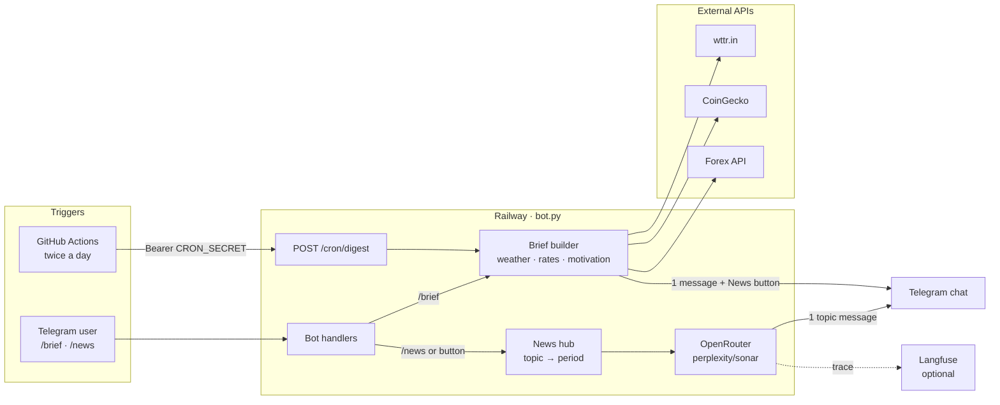

# Daily Digest Bot

[](https://github.com/cheslav-zhur/my-daily-digest/actions/workflows/tests.yml)
[](https://railway.app)
[](https://github.com/features/actions)

[](https://www.python.org/downloads/)
[](https://core.telegram.org/bots)
[](https://openrouter.ai)
[](https://langfuse.com)

Personal morning briefing in Telegram: weather, crypto/forex rates, and news (11 topics across tech, world, politics).

Stateless — no database, each run is independent.

## What it sends

- **Weather** — Da Nang (wttr.in)
- **Rates** — BTC, ETH (CoinGecko), VND/USD (forex API)
- **News** — 11 topics in 3 groups (tech, world, politics) via [OpenRouter](https://openrouter.ai) (`perplexity/sonar`): Russian summary + links; search in English

Full digest HTML is assembled in code (`report.py`) — no LLM for weather/rates layout.

## Stack

- Python 3.11+
- **GitHub Actions** — cron trigger (`curl POST /cron/digest`)
- **Railway** — digest execution + Telegram bot (`bot.py`, webhook or polling)
- **OpenRouter** — news (Perplexity Sonar)
- **Langfuse** — optional tracing
- python-telegram-bot, requests, feedparser

## Architecture



Brief on cron does **not** call the LLM. News run only on demand: one OpenRouter request per topic + period.

## Quick start

```bash
cp .env.example .env   # fill TELEGRAM_* and OPENROUTER_API_KEY
pip install -r requirements.txt
python main.py         # send full digest once (local)
python bot.py          # bot (polling locally)
```

**Full setup** (secrets, GitHub, Railway, Langfuse, debug scripts): see **[SETUP.md](SETUP.md)**.

## Project layout

Top level:

- `main.py` — local: full digest → Telegram
- `bot.py` — Telegram bot (`/brief`, `/news`, …)
- `digest/` — content fetchers, news pipeline, Telegram delivery
- `scripts/` — dev/debug helpers
- `.github/workflows/` — daily cron → Railway

Full annotated tree — see **[AGENTS.md](AGENTS.md)** (canonical source for project structure).

## Modes

| Mode | Entry | Where |
|------|-------|-------|
| Scheduled digest | `POST /cron/digest` | GitHub Actions → Railway |
| Local digest | `python main.py` | dev machine |
| Bot commands | `python bot.py` | Railway or local |

Agent / contributor notes: **[AGENTS.md](AGENTS.md)**.
