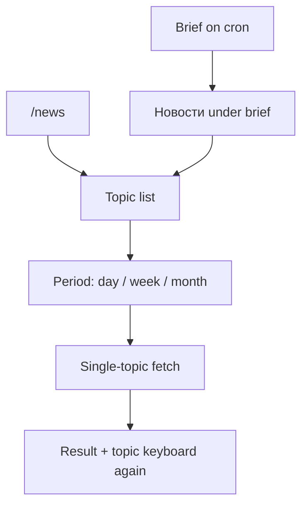
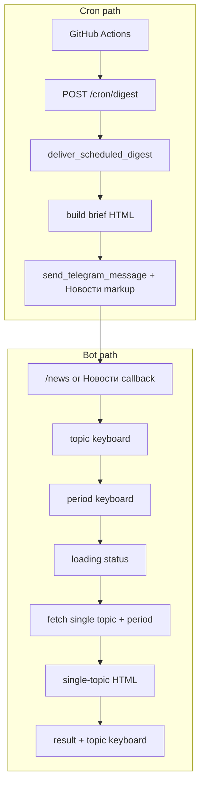

# On-Demand Topic News - Plan

## Goal Capsule

- **Objective:** Replace push-all news with an on-demand «Новости» hub: pick one topic, then a period (day / week / month), then fetch only that request — while scheduled brief (weather, rates, motivation) stays on cron.
- **Product authority:** This plan owns news delivery shape and entry points. Topic-list edits and a short scheduled news «top» are not active scope.
- **Product Contract preservation:** unchanged (stable R/F/AE/KD IDs retained; Outstanding Questions resolved into Planning Contract).
- **Open blockers:** None.
- **Execution profile:** code — implement on branch `feat/on-demand-topic-news`; verify with `pytest` before merge.
- **Stop conditions:** Stop if a settled product decision proves infeasible (e.g. provider cannot honor week/month); escalate rather than silently dropping periods.

---

## Product Contract

### Summary

Scheduled brief stays morning and evening.
Scheduled auto-news stops.
News is requested only through a shared «Новости» hub (button under the brief and `/news`): topic → period → one topic fetch.
Current topic set stays unchanged in this release.

### Problem Frame

The personal digest has been in production for weeks.
Morning cron still spends tokens on nine topics while the owner rarely opens the bot and does not want a long unread wall.
The pain is wasted spend plus overload, not missing coverage.
Success is that the owner actually opens, picks, and reads — not that every topic arrives unsolicited.

### Key Decisions

- KD1. **No scheduled auto-news** — news only on request.
  (session-settled: user-directed — chosen over short scheduled «top» / keep push as today: tokens must not burn without a request)
  Governs R1, R2.
- KD2. **Brief stays on morning and evening cron** — weather, rates, motivation unchanged as the free push.
  (session-settled: user-directed — chosen over brief-also-on-demand)
  Governs R3.
- KD3. **Hub «Новости», not topics under the brief** — one shared entry; cleaner keyboard, one extra tap.
  (session-settled: user-directed — chosen over topics-on-brief / sticky period)
  Governs R4, R5, F1.
- KD4. **Period every request** — day / week / month chosen after topic, not a sticky default.
  (session-settled: user-directed — chosen over day-only / sticky period)
  Governs R6, R7, F1.
- KD5. **Topic list unchanged this release** — edits deferred.
  Governs R8.
- KD6. **Minimum ship is hub + period** — no smaller cut.
  (session-settled: user-directed — chosen over buttons-only or turn-off-cron-keep-/news-all)
  Governs R4–R7.

### Requirements

**Scheduled delivery**

- R1. Morning and evening cron never auto-deliver news groups; only the brief section is scheduled.
- R2. Opening the bot or waiting for cron never spends news LLM tokens unless the user completes a hub request.
- R3. Morning and evening cron continue to deliver the brief (date, weather, rates, motivation) as today.

**News hub**

- R4. `/news` opens the «Новости» hub (topic choices), not a fetch of all topics.
- R5. The scheduled brief message includes a «Новости» control that opens the same hub as `/news`.
- R6. Hub flow is topic first, then period (day / week / month), then a single-topic news fetch for that pair.
- R7. One completed request fetches and delivers news for exactly one topic and one period (no all-topics bundle from the hub).
- R8. The set of topics and groups available in the hub matches the current product topic list; renaming/adding/removing topics is out of scope for this release.

**Content shape**

- R9. A successful single-topic response is readable as one focused brief for that topic and period (not three group messages).
- R10. If a topic has nothing relevant for the chosen period, the user gets a clear empty/unavailable outcome for that request only; other topics remain requestable.

### Key Flows

- F1. Request news from brief or command
  - **Trigger:** User taps «Новости» under a brief, or sends `/news`
  - **Actors:** Owner (sole authorized user)
  - **Steps:** Hub shows topics → user picks one topic → hub shows periods → user picks day, week, or month → system fetches and delivers that one topic for that period → topic keyboard returns for another pick
  - **Outcome:** One topic message (or empty/unavailable for that request); no other topics fetched
  - **Covered by:** R4, R5, R6, R7, R9, R10

- F2. Scheduled brief without news
  - **Trigger:** Morning or evening cron fires
  - **Actors:** Cron → bot → owner
  - **Steps:** Deliver brief only; attach «Новости» entry to the brief message; do not fetch or send news groups
  - **Outcome:** Brief arrives; news tokens not spent until hub completion
  - **Covered by:** R1, R2, R3, R5

### Acceptance Examples

- AE1. Morning cron without news
  - **Covers:** R1, R2, R3, R5
  - **Given:** Morning schedule runs
  - **When:** Digest delivery completes
  - **Then:** Owner receives the brief with a «Новости» entry and does not receive auto news-group messages; no news LLM calls ran for that cron

- AE2. Hub path from `/news`
  - **Covers:** R4, R6, R7, R9
  - **Given:** Owner sends `/news`
  - **When:** They pick topic «ИИ», then period «неделя»
  - **Then:** Exactly one ИИ fetch for week runs and one focused reply is delivered; other topics are not fetched

- AE3. Empty period for one topic
  - **Covers:** R10
  - **Given:** Owner completes hub for a topic/period with no relevant items
  - **When:** Fetch returns empty/unavailable
  - **Then:** They see a clear empty outcome for that request and can still open the hub for another topic

- AE4. Evening brief still has hub entry
  - **Covers:** R3, R5
  - **Given:** Evening cron runs (brief-only schedule)
  - **When:** Brief is delivered
  - **Then:** Brief includes the same «Новости» entry as morning; no auto news

### Success Criteria

- S1. Owner reports they actually open the bot and read requested topics (primary signal from dialogue).
- S2. News LLM spend happens only on completed hub requests, not on unread morning dumps.
- S3. Brief remains a reliable lightweight push without forcing a news wall.

### Scope Boundaries

**Deferred for later**

- Changing the topic list (add/rename/remove/reorder).
- Short scheduled auto-«top» (1–2 topics or compressed digest) — backlog to reconsider later.
- Sticky period (remember last window; topic-only taps).
- Topics listed directly under the brief (no hub).

**Outside this work**

- Multi-user digest / SQLite subscriber model (`docs/brainstorms/2026-06-13-multi-user-digest-requirements.md`).
- News-failure visibility redesign (`docs/brainstorms/2026-08-03-news-failure-visibility-requirements.md`) except where single-topic empty states are required by R10.

### Dependencies / Assumptions

- A1. Sole actor remains the existing authorized Telegram user; auth model unchanged.
- A2. Period values are day, week, month — implemented per KTD2.
- A3. After delivery, return to topic keyboard without retyping `/news` — implemented per KTD4.
- A4. Baseline before change: all-nine topics with day/24h recency and no inline keyboards.

### Outstanding Questions

**Resolve Before Planning**

- None.

**Deferred to Implementation**

- Q1. Exact Telegram message choreography for return-to-hub (edit vs new message) — honor KTD4 intent.
- Q2. Whether residual `fetch_grouped_news` stays as a private/test helper or is deleted once unused — prefer delete if nothing calls it.
- Q3. Russian button labels for periods (e.g. «День» / «Неделя» / «Месяц») — keep short and clear.

### Sources / Research

- Delivery today: morning brief+news, evening brief-only via `?news=0`; `/news` runs full grouped fetch — `AGENTS.md`, `.github/workflows/daily.yml`, `digest/scheduled.py`.
- No inline keyboards / callback handlers — `digest/telegram/handlers.py` is command-only.
- Recency today is day/24h only — `digest/content/news/fetch.py`, `prompt.py`, `topics.py`.
- Perplexity `search_recency_filter` accepts `day` / `week` / `month` (and hour/year) — provider docs; map product periods 1:1.
- Nine topics / three groups — `digest/content/news/topics.py`.
- Stateless / no DB — `AGENTS.md`, `README.md`.
- Graceful degradation pattern — `docs/solutions/2026-07-08-coingecko-429-rates-unavailable.md` (rates; apply same principle to R10).
- Adjacent (out of scope): `docs/brainstorms/2026-06-13-multi-user-digest-requirements.md`, `docs/brainstorms/2026-08-03-news-failure-visibility-requirements.md`.

---

## Planning Contract

### Key Technical Decisions

- KTD1. **Greenfield Telegram inline hub** — `InlineKeyboardMarkup` + `CallbackQueryHandler`; extract keyboard/callback helpers into `digest/telegram/news_hub.py` so `handlers.py` stays thin. Auth every callback with existing `is_authorized`. Compact `callback_data` under Telegram’s 64-byte limit (e.g. topic pick + period pick prefixes).
  Governs R4, R5, R6, F1.
- KTD2. **Period → provider + prompt** — map `day`/`week`/`month` to OpenRouter/Perplexity `search_recency_filter` with the same tokens; parameterize `build_topic_prompt` and empty/unavailable copy for the window; keep existing `search_brief` text in `topics.py` and inject the period window in the prompt builder so R8 (no topic-list edits) holds.
  Governs R6, R7, R9, R10.
- KTD3. **Cron always brief-only** — `scheduled_sections` returns only `BRIEF`; simplify/remove morning `?news=` branching in `.github/workflows/daily.yml` and stop using `include_news` to attach NEWS. Manual local runs never auto-fetch news.
  (session-settled: user-directed — chosen over keeping `include_news` / `?news=` for manual news dumps)
  Governs R1, R2, F2.
- KTD4. **Return to topic keyboard after each result** — after single-topic delivery (success or empty), present the same topic keyboard again so another topic can be chosen without `/news`.
  (session-settled: user-approved — chosen as plan default for A3 / S1)
  Governs R10, AE3, S1.
- KTD5. **Remove all-topics NEWS from hot path** — `/news` and cron must not call `fetch_grouped_news`; replace interactive path with hub + `fetch` one topic. Update or delete tests that assert grouped cron/`DigestSection.NEWS` behavior.
  Governs R4, R7.
- KTD6. **Loading UX** — reuse the existing «⏳ Собираю данные...» status pattern from `run_section` for the period→fetch step (edit or answer callback then show progress).
  Governs Q3 (former deferred).

### High-Level Technical Design

Two delivery surfaces share one hub builder: cron attaches a single «Новости» button via `reply_markup` on the brief; interactive `/news` opens the topic list directly. Fetch stays in `digest/content/news/` as pure sync work; handlers wrap it with `asyncio.to_thread` as today.

### Assumptions

- Perplexity via OpenRouter honors `search_recency_filter` values `week` and `month` the same way as current top-level `day` in `_chat_extra` (already used for day in-repo).
- `python-telegram-bot>=22.5` supports inline keyboards and callback queries in both webhook and polling modes already used by the bot.
- Topic order on the keyboard follows existing `NEWS_GROUPS` / `NEWS_TOPICS` order without product redesign.

### Implementation Constraints

- No DB / Redis / queues (AGENTS.md).
- Functions + dataclasses; no DI frameworks.
- Telegram news HTML: only `<b>` and `<a href>`; HTML→plain fallback on send/edit failures.
- Graceful degradation: one failed/empty topic request must not break the hub.
- Do not install new packages without explicit approval (stdlib + existing PTB/OpenRouter stack).
- Test pure helpers with `pytest`; no live OpenRouter/Telegram in CI.

### Sequencing

1. U1 cron brief-only (stops token waste immediately; unblocks safe deploy of later units).
2. U2 period-aware single-topic pipeline (no Telegram UX yet; testable).
3. U3 hub UX + `/news` + return-to-hub (depends on U2).
4. U4 brief «Новости» button on cron (depends on U1 + U3 keyboard builders).
5. U5 docs/HELP/AGENTS + remove dead grouped hot-path callers (depends on U3–U4).

---

## Implementation Units

### U1. Cron delivers brief only

**Goal:** Scheduled runs never fetch or send news groups.
**Requirements:** R1, R2, R3, F2, AE1, AE4 (partial — button comes in U4)
**Dependencies:** —
**Files:**
- `digest/scheduled.py` (modify)
- `digest/telegram/webhook.py` (modify — drop or ignore `news` query for NEWS)
- `.github/workflows/daily.yml` (modify — remove evening-only `?news=0` special case if both are brief-only)
- `main.py` (modify if default still implies news)
- `tests/test_scheduled.py` (modify)
**Approach:**
1. Make `scheduled_sections` always `(DigestSection.BRIEF,)`.
2. Align workflow and webhook so morning and evening both brief-only.
3. Flip tests that expect `NEWS` in the default schedule.
**Patterns to follow:** Existing `include_news=False` evening path in `tests/test_scheduled.py`.
**Test scenarios:**
- `Covers AE1.` `scheduled_sections()` returns only BRIEF.
- Morning and evening workflow URLs both avoid triggering news (or flag removed).
**Verification:** `pytest tests/test_scheduled.py` passes; no code path from `deliver_scheduled_digest` to `fetch_grouped_news`.

### U2. Period-aware single-topic news pipeline

**Goal:** Fetch and format one topic for day/week/month without Telegram.
**Requirements:** R6, R7, R9, R10
**Dependencies:** —
**Files:**
- `digest/content/news/fetch.py` (modify)
- `digest/content/news/prompt.py` (modify)
- `digest/content/news/parse.py` (modify — period-aware empty copy)
- `digest/content/report.py` (modify — single-topic HTML helper)
- `digest/content/news/__init__.py` (modify exports)
- `scripts/openrouter_call.py` (modify — optional `--period`)
- `tests/content/news/test_prompt.py` (modify)
- `tests/content/news/test_parse.py` (modify as needed)
- `tests/content/test_report.py` (modify)
- `tests/content/news/test_fetch_grouping.py` (modify or shrink if grouped path removed later)
**Approach:**
1. Introduce a small period type/enum (`day` | `week` | `month`).
2. Parameterize `_chat_extra(period)` and `build_topic_prompt(topic, report_date, period)`.
3. Expose `fetch_topic_news(topic_id | NewsTopic, report_date, period)` reusing `_fetch_topic_block`.
4. Add `build_single_topic_news_html` (or equivalent) using existing topic-block formatting + optional cost line.
5. Do not edit the nine `search_brief` strings in `topics.py` (R8 / KTD2).
**Execution note:** Test-first on prompt period wording and empty-copy strings before wiring OpenRouter extras.
**Patterns to follow:** `_fetch_topic_block`, `payload_to_topic_block`, `build_news_delivery_messages` body helpers; `TESTING.md` property assertions.
**Test scenarios:**
- Prompt for week mentions week window / not hard-coded «только 24 часа» as the sole rule.
- `_chat_extra("month")` sets `search_recency_filter` to `month`.
- `Covers AE3.` Empty/NO_NEWS path yields period-appropriate unavailable text.
- Single-topic HTML includes topic label and at most allowed links; no three group headers.
**Verification:** `pytest tests/content/news/test_prompt.py tests/content/test_report.py` (and related) green.

### U3. News hub UX (`/news` + callbacks)

**Goal:** Interactive topic → period → fetch → return-to-hub flow.
**Requirements:** R4, R6, R7, R9, R10, F1, AE2, AE3, S1
**Dependencies:** U2
**Files:**
- `digest/telegram/news_hub.py` (create)
- `digest/telegram/handlers.py` (modify)
- `digest/content/service.py` (modify — stop `/news` using grouped NEWS)
- `tests/telegram/test_news_hub.py` (create — pure keyboard/callback helpers)
**Approach:**
1. Build topic keyboard from `NEWS_GROUPS` / `NEWS_TOPICS`; period keyboard for the three windows.
2. `/news` sends hub (topics), not `build_digest_delivery(NEWS)`.
3. Callbacks: authorize → topic → show periods → period → loading → `asyncio.to_thread` single-topic fetch → deliver HTML → reattach topic keyboard (KTD4).
4. Register `CallbackQueryHandler` next to existing command handlers.
**Patterns to follow:** `run_section` loading text; `edit_html_message` / `send_html_reply` HTML fallback; `is_authorized`.
**Test scenarios:**
- `Covers AE2.` Callback encode/decode round-trip for topic id + period.
- Topic keyboard lists all current topic ids exactly once (R8).
- Unauthorized callback is rejected (mirrors command auth).
**Verification:** `pytest tests/telegram/test_news_hub.py` + existing handler-adjacent tests; manual smoke optional outside CI.

### U4. «Новости» button on scheduled brief

**Goal:** Cron brief carries the hub entry control (R5).
**Requirements:** R5, F2, AE1, AE4
**Dependencies:** U1, U3
**Files:**
- `digest/telegram/delivery.py` (modify — optional `reply_markup`)
- `digest/scheduled.py` (modify — attach hub entry markup to brief)
- `digest/telegram/news_hub.py` (modify — export brief entry keyboard builder)
**Approach:**
1. Extend `send_telegram_message` to accept optional `reply_markup` on both HTML and plain fallback sends.
2. Brief cron send uses a one-button «Новости» keyboard that opens the same hub as `/news`.
3. Same markup morning and evening (Q4 closed: same behavior/copy).
**Patterns to follow:** Existing HTML/plain dual-path in `delivery.py`.
**Test scenarios:**
- Brief entry keyboard callback payload matches hub opener used by `/news`.
- `send` helper passes markup through when provided (unit-level if extractable).
**Verification:** Markup builder tests pass; local or staging cron brief shows the button.

### U5. Docs and dead-path cleanup

**Goal:** Docs and help match on-demand hub; remove leftover all-topics hot path.
**Requirements:** R4, R8; supports S2 clarity
**Dependencies:** U3, U4
**Files:**
- `digest/telegram/handlers.py` (`HELP_TEXT`, `BOT_COMMANDS`)
- `AGENTS.md` (modify)
- `SETUP.md` (modify if it documents `/news` / cron news)
- `digest/content/service.py` / `digest/content/news/fetch.py` (remove unused grouped hot-path if orphaned)
- `tests/content/news/test_fetch_grouping.py` (update or delete)
**Approach:**
1. Rewrite help strings for hub + periods.
2. Update AGENTS delivery/cron narrative.
3. Delete or quarantine unused grouped fetch callers/tests per KTD5 / Q2.
**Test expectation:** none beyond fixing broken tests from removals — docs-only otherwise.
**Verification:** `pytest` full suite green; AGENTS/HELP no longer claim morning auto-news or «3 сообщения по группам» as the `/news` behavior.

---

## Verification Contract

| Gate | Command / check | Applies to |
|------|-----------------|------------|
| Unit/integration (CI) | `pytest` | All units; required green |
| Scheduled contract | `pytest tests/test_scheduled.py` | U1 |
| News pure core | `pytest tests/content/news/ tests/content/test_report.py` | U2 |
| Hub helpers | `pytest tests/telegram/test_news_hub.py` | U3–U4 |
| Manual smoke (optional) | Local bot: `/news` → topic → period; confirm one LLM call; cron brief shows «Новости» | Pre-merge confidence |

No `release:validate` in this repo. No new prod dependencies.

---

## Definition of Done

**Global**

- [ ] R1–R10 satisfied on branch `feat/on-demand-topic-news`
- [ ] `pytest` green in CI
- [ ] Morning/evening cron send brief + «Новости» button only; no auto news LLM
- [ ] `/news` never fetches all nine topics
- [ ] HELP/AGENTS match behavior
- [ ] No unresolved Resolve-Before-Planning items

**Per unit**

- U1: schedule tests assert brief-only
- U2: period prompt/recency/empty/single-topic HTML tests exist and pass
- U3: hub helper tests + `/news` opens hub
- U4: brief markup wired through cron delivery
- U5: docs/help updated; dead grouped hot path gone or explicitly non-hot
